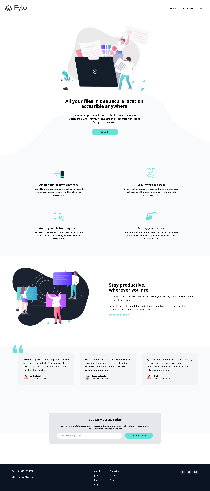
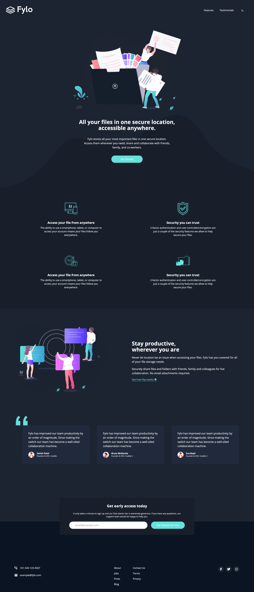

# Fylo Static Website

This project is a simple static website inspired by [Frontend Mentor Challenge](https://www.frontendmentor.io/challenges/fylo-dark-theme-landing-page-5ca5f2d21e82137ec91a50fd). It includes a button to toggle between dark and light themes, which is stored in `localStorage`. The website is fully responsive and built using Tailwind CSS, HTML, and JavaScript.

## Features

- **Dark/Light Theme Toggle**: Users can switch between dark and light themes, with their preference saved in `localStorage`.
- **Responsive Design**: The layout is responsive, ensuring a great user experience on both mobile and desktop devices.
- **Built with Tailwind CSS**: Utilizes the Tailwind CSS framework for rapid and customizable styling.

## Getting Started

### Prerequisites

Make sure you have [Node.js](https://nodejs.org/) installed on your machine.

## Usage

- **Install dependencies**:
`npm install`
- **Run Tailwind CLI using npm**:
`npm run watch`
- Open `index.html` in your preferred browser to view the website.

## Built With

- [Tailwind CSS](https://tailwindcss.com/) - Utility-first CSS framework for styling.
- HTML - Markup language used for structuring the website.
- JavaScript - For the theme toggle functionality.

